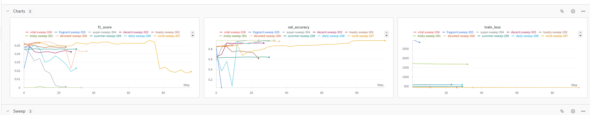
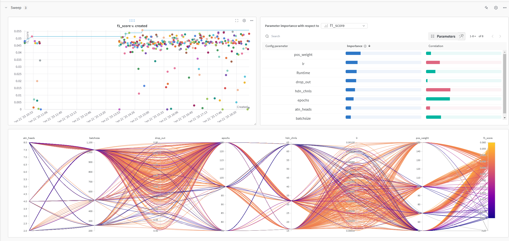
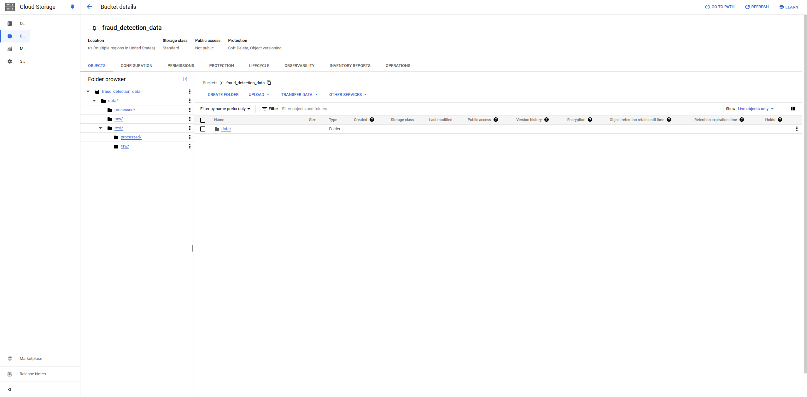
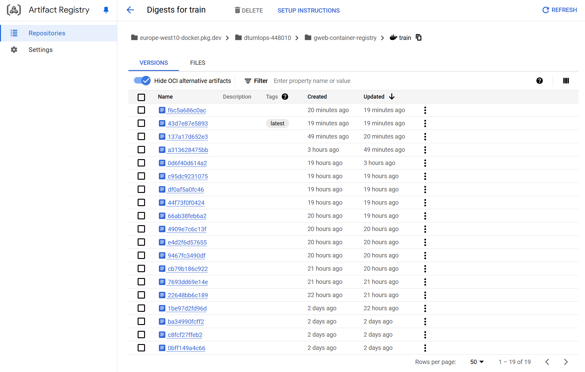
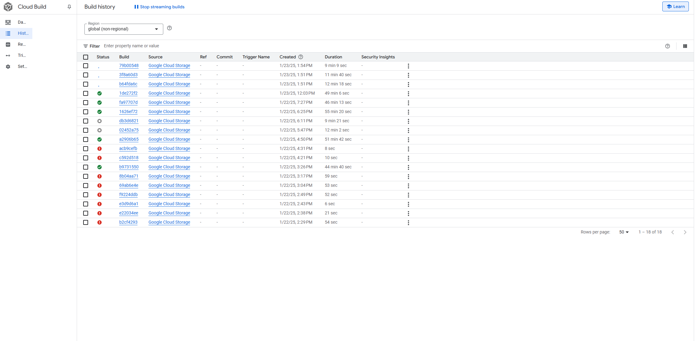

# Exam template for 02476 Machine Learning Operations

This is the report template for the exam. Please only remove the text formatted as with three dashes in front and behind
like:

```--- question 1 fill here ---```

Where you instead should add your answers. Any other changes may have unwanted consequences when your report is
auto-generated at the end of the course. For questions where you are asked to include images, start by adding the image
to the `figures` subfolder (please only use `.png`, `.jpg` or `.jpeg`) and then add the following code in your answer:

```markdown

```

In addition to this markdown file, we also provide the `report.py` script that provides two utility functions:

Running:

```bash
python report.py html
```

Will generate a `.html` page of your report. After the deadline for answering this template, we will auto-scrape
everything in this `reports` folder and then use this utility to generate a `.html` page that will be your serve
as your final hand-in.

Running

```bash
python report.py check
```

Will check your answers in this template against the constraints listed for each question e.g. is your answer too
short, too long, or have you included an image when asked. For both functions to work you mustn't rename anything.
The script has two dependencies that can be installed with

```bash
pip install typer markdown
```

## Overall project checklist

The checklist is *exhaustive* which means that it includes everything that you could do on the project included in the
curriculum in this course. Therefore, we do not expect at all that you have checked all boxes at the end of the project.
The parenthesis at the end indicates what module the bullet point is related to. Please be honest in your answers, we
will check the repositories and the code to verify your answers.

### Week 1

* [x] Create a git repository (M5)
* [x] Make sure that all team members have write access to the GitHub repository (M5)
* [x] Create a dedicated environment for you project to keep track of your packages (M2)
* [x] Create the initial file structure using cookiecutter with an appropriate template (M6)
* [x] Fill out the `data.py` file such that it downloads whatever data you need and preprocesses it (if necessary) (M6)
* [x] Add a model to `model.py` and a training procedure to `train.py` and get that running (M6)
* [x] Remember to fill out the `requirements.txt` and `requirements_dev.txt` file with whatever dependencies that you
    are using (M2+M6)
* [x] Remember to comply with good coding practices (`pep8`) while doing the project (M7)
* [ ] Do a bit of code typing and remember to document essential parts of your code (M7)
* [x] Setup version control for your data or part of your data (M8)
* [x] Add command line interfaces and project commands to your code where it makes sense (M9)
* [x] Construct one or multiple docker files for your code (M10)
* [x] Build the docker files locally and make sure they work as intended (M10)
* [x] Write one or multiple configurations files for your experiments (M11)
* [ ] Used Hydra to load the configurations and manage your hyperparameters (M11)
* [ ] Use profiling to optimize your code (M12)
* [x] Use logging to log important events in your code (M14)
* [x] Use Weights & Biases to log training progress and other important metrics/artifacts in your code (M14)
* [x] Consider running a hyperparameter optimization sweep (M14)
* [ ] Use PyTorch-lightning (if applicable) to reduce the amount of boilerplate in your code (M15)

### Week 2

* [x] Write unit tests related to the data part of your code (M16)
* [x] Write unit tests related to model construction and or model training (M16)
* [x] Calculate the code coverage (M16)
* [x] Get some continuous integration running on the GitHub repository (M17)
* [x] Add caching and multi-os/python/pytorch testing to your continuous integration (M17)
* [x] Add a linting step to your continuous integration (M17)
* [x] Add pre-commit hooks to your version control setup (M18)
* [ ] Add a continues workflow that triggers when data changes (M19)
* [ ] Add a continues workflow that triggers when changes to the model registry is made (M19)
* [x] Create a data storage in GCP Bucket for your data and link this with your data version control setup (M21)
* [x] Create a trigger workflow for automatically building your docker images (M21)
* [ ] Get your model training in GCP using either the Engine or Vertex AI (M21)
* [x] Create a FastAPI application that can do inference using your model (M22)
* [ ] Deploy your model in GCP using either Functions or Run as the backend (M23)
* [ ] Write API tests for your application and setup continues integration for these (M24)
* [ ] Load test your application (M24)
* [ ] Create a more specialized ML-deployment API using either ONNX or BentoML, or both (M25)
* [x] Create a frontend for your API (M26)

### Week 3

* [ ] Check how robust your model is towards data drifting (M27)
* [ ] Deploy to the cloud a drift detection API (M27)
* [x] Instrument your API with a couple of system metrics (M28)
* [ ] Setup cloud monitoring of your instrumented application (M28)
* [ ] Create one or more alert systems in GCP to alert you if your app is not behaving correctly (M28)
* [ ] If applicable, optimize the performance of your data loading using distributed data loading (M29)
* [ ] If applicable, optimize the performance of your training pipeline by using distributed training (M30)
* [ ] Play around with quantization, compilation and pruning for you trained models to increase inference speed (M31)

### Extra

* [x] Write some documentation for your application (M32)
* [ ] Publish the documentation to GitHub Pages (M32)
* [x] Revisit your initial project description. Did the project turn out as you wanted?
* [ ] Create an architectural diagram over your MLOps pipeline
* [x] Make sure all group members have an understanding about all parts of the project
* [x] Uploaded all your code to GitHub

## Group information

### Question 1
> **Enter the group number you signed up on <learn.inside.dtu.dk>**
>
> Answer:

Group 97

### Question 2
> **Enter the study number for each member in the group**
>
> Example:
>
> *sXXXXXX, sXXXXXX, sXXXXXX*
>
> Answer:

 *s203788, s203557, s193602, s203572*

### Question 3
> **A requirement to the project is that you include a third-party package not covered in the course. What framework**
> **did you choose to work with and did it help you complete the project?**
>
> Recommended answer length: 100-200 words.
>
> Example:
> *We used the third-party framework ... in our project. We used functionality ... and functionality ... from the*
> *package to do ... and ... in our project*.
>
> Answer:
--- question 3 fill here ---
We chose to use the PyTorch Geometric framework for our project. This package helped us create the dataset and sample batches from the graph. The torch geometrics neighborloader made it possible to train and test in batches, which else could have become a problem, as the graph would be too sparse in batches. It also provided us with the Graph Attention Network (GAT), which we used to build neural networks that work with graph data. This was really useful for our project, as we needed to process graph-structured data for fraud detection. The framework made it easier to implement these tasks, especially when working with large graphs and performing graph-based learning. 

## Coding environment

> In the following section we are interested in learning more about you local development environment. This includes
> how you managed dependencies, the structure of your code and how you managed code quality.

### Question 4

> **Explain how you managed dependencies in your project? Explain the process a new team member would have to go**
> **through to get an exact copy of your environment.**
>
> Recommended answer length: 100-200 words
>
> Example:
> *We used ... for managing our dependencies. The list of dependencies was auto-generated using ... . To get a*
> *complete copy of our development environment, one would have to run the following commands*
>
> Answer:

--- question 4 fill here ---
We managed dependencies with Pip, Conda and the requirements file. To get started with the project a new member would have to first clone the repository and then create a Conda environment with Python version 3.11. After this it is recommended to install the "invoke" package with pip which makes installing the dependencies easier. During the project we encountered a problem with Torch Geometric where it is able to install, but is missing a package. This package can not be installed regularly. A fix for this is to download torch packages in a very specific order which is performed via the invoke command. It is not possible to download the required packages merely via the requirements.txt file.

### Question 5

> **We expect that you initialized your project using the cookiecutter template. Explain the overall structure of your**
> **code. What did you fill out? Did you deviate from the template in some way?**
>
> Recommended answer length: 100-200 words
>
> Example:
> *From the cookiecutter template we have filled out the ... , ... and ... folder. We have removed the ... folder*
> *because we did not use any ... in our project. We have added an ... folder that contains ... for running our*
> *experiments.*
>
> Answer:

--- question 5 fill here ---
We mostly stuck to the cookie cutter template. The source directory contains all the python files required for training and evaluating the model, in the models folder we store any models of importance. We initially used a notebook in the "Notebooks" folder to first test the model and debug, but it was quickly made obsolote and we did not really use notbooks for anything. As we ran some training on the DTU high performance cluster, we added a folder called sh_scripts which contains a shell script which submits wandb agents for training as bsub jobs.  

### Question 6

> **Did you implement any rules for code quality and format? What about typing and documentation? Additionally,**
> **explain with your own words why these concepts matters in larger projects.**
>
> Recommended answer length: 100-200 words.
>
> Example:
> *We used ... for linting and ... for formatting. We also used ... for typing and ... for documentation. These*
> *concepts are important in larger projects because ... . For example, typing ...*
>
> Answer:

--- question 6 fill here ---
We used Ruff for linting and formatting. This was also added in a pre-commit hook to automate the formatting. In larger projects where multiple people collaborate, it is important to standardize as much as possible to ensure that everyone is able to understand the code and to make it more readable. The functionality of code that was written will eventually be forgotten and if no documentation is provided you need to "Re-understand" the code every time someone has to change or use it. Documentation also ensures that future collaborators are able to be onboarded quicker when they are able to understand the project.

## Version control

> In the following section we are interested in how version control was used in your project during development to
> corporate and increase the quality of your code.

### Question 7

> **How many tests did you implement and what are they testing in your code?**
>
> Recommended answer length: 50-100 words.
>
> Example:
> *In total we have implemented X tests. Primarily we are testing ... and ... as these the most critical parts of our*
> *application but also ... .*
>
> Answer:

We have implemented a total of 10 tests across two test files. The test_data.py file contains 9 tests that test the pipeline for data processing, and includes tests for the loading of data, the feature matrix, edge indices, label shapes, and graph connectivity. Finally, this file tests the functionality of node splits as well as edge attributes. The test_model.py file contains a test that verifies the GCN model architecture and ensures it functions as intended, by checking that there is a correct input-output compatibility during the forward pass. 

### Question 8

> **What is the total code coverage (in percentage) of your code? If your code had a code coverage of 100% (or close**
> **to), would you still trust it to be error free? Explain you reasoning.**
>
> Recommended answer length: 100-200 words.
>
> Example:
> *The total code coverage of code is X%, which includes all our source code. We are far from 100% coverage of our **
> *code and even if we were then...*
>
> Answer:

The total code coverage of the aforementioned tests of our code is 68%. This is very far from 100%, and can definitely be optimized. The beauty of unit tests is that there are never enough, and it is therefore wholly possible (and probably necessary) to write many more tests for our code, particularly for the train.py file, as this is detrimental to the models functionality. 
However, even if we did reach a code coverage of 100%, this would not ensure that our code works perfectly. Code coverage is only a tool for measuring how much of the code is executed during testing, and does not have anything to do with whether the code works as intended under any and all circumstances. There is still the possibility for logic errors, integration issues or unexpected edge cases, even if the coverage is very high. 

### Question 9

> **Did you workflow include using branches and pull requests? If yes, explain how. If not, explain how branches and**
> **pull request can help improve version control.**
>
> Recommended answer length: 100-200 words.
>
> Example:
> *We made use of both branches and PRs in our project. In our group, each member had an branch that they worked on in*
> *addition to the main branch. To merge code we ...*
>
> Answer:
We used some branches, but it was not employed by all members of the group. We recognize that branches are extremely useful particularly for bigger groups than ours as they allow developers to work in parallel on the same code without impacting the main codebase. This parallel workflow helps reduce conflicts and streamline collaboration. The implementation of the work done in these branches is aided by pull requests, which allow for thorough review, collaboration, discussion of potential issues, and approval of changes before they are merged into the main branch, ensuring code quality, consistency, and better teamwork. As time was limited for our project we chose to prioritize creating more and reviewing less, although for larger projects this should be implemented carefully.

### Question 10

> **Did you use DVC for managing data in your project? If yes, then how did it improve your project to have version**
> **control of your data. If no, explain a case where it would be beneficial to have version control of your data.**
>
> Recommended answer length: 100-200 words.
>
> Example:
> *We did make use of DVC in the following way: ... . In the end it helped us in ... for controlling ... part of our*
> *pipeline*
>
> Answer:

--- question 10 fill here ---
We implemented DVC on our data, although it was not fully utilized in this project. We did not change the data after implementing DVC, so there was no real version control. We created a subset of the data, but we still have both versions of the data present. We used it mostly to share the processed data amongst the team members through version control so the preprocessing only needed to be performed once. As we implemented DVC in a google cloud bucket it also enabled us to utilize the data in the cloud. Data version control is beneficial if the data changes while the project is proceeding. It can allow for one team member to keep collecting data or changing the data, while another may work on the model without breaking the script model or having to change the script. 

### Question 11

> **Discuss you continuous integration setup. What kind of continuous integration are you running (unittesting,**
> **linting, etc.)? Do you test multiple operating systems, Python  version etc. Do you make use of caching? Feel free**
> **to insert a link to one of your GitHub actions workflow.**
>
> Recommended answer length: 200-300 words.
>
> Example:
> *We have organized our continuous integration into 3 separate files: one for doing ..., one for running ... testing*
> *and one for running ... . In particular for our ..., we used ... .An example of a triggered workflow can be seen*
> *here: <weblink>*
>
> Answer:

--- question 11 fill here ---
We have organized our continuous integration into an automated testing workflow that is triggered on every push to main. The workflow is focused on the robustness and correct utilization of our code. The unit tests can be found in the files test_data.py and test_model.py located in the tests folder. 
The workflow caches the project dependencies to optimize performance, and thus significantly reduces the time it takes to perform the tests. This caching mechanism significantly speeds up the workflow execution, and is thereby useful for optimizing the runtime. The tests cover 3 different versions of python (namely, 3.10, 3.11 and 3.12). Finally, it runs on a Linux-based runner (ubuntu-latest), which is a reliable and widely used setup for Python applications, and thus suited for our purposes. 
An example of a triggered workflow can be seen here:
https://github.com/anto1282/G-WEB_Fraud_Detection/blob/main/.github/workflows/test-and-build.yaml  
This integration ensures that any new changes pushed to the main branch are thoroughly tested, improving the stability and reliability of our application. 
In the future, we plan to extend our continuous integration to include more tests for various aspects of the code, to achieve a 100% coverage, and to test on different operating systems (namely macos and windows).
test_data.py


## Running code and tracking experiments

> In the following section we are interested in learning more about the experimental setup for running your code and
> especially the reproducibility of your experiments.

### Question 12

> **How did you configure experiments? Did you make use of config files? Explain with coding examples of how you would**
> **run a experiment.**
>
> Recommended answer length: 50-100 words.
>
> Example:
> *We used a simple argparser, that worked in the following way: Python  my_script.py --lr 1e-3 --batch_size 25*
>
> Answer:

--- question 12 fill here ---
We used config files in yaml format to parse arguments to the training. We have 7 different parameters which could be tuned. Learning rate, batchsize, nr. of channels in hidden layer, nr. of attention heads, drop out fraction, number of epochs and a loss function regularization weight. 

### Question 13

> **Reproducibility of experiments are important. Related to the last question, how did you secure that no information**
> **is lost when running experiments and that your experiments are reproducible?**
>
> Recommended answer length: 100-200 words.
>
> Example:
> *We made use of config files. Whenever an experiment is run the following happens: ... . To reproduce an experiment*
> *one would have to do ...*
>
> Answer:

--- question 13 fill here ---
To ensure reproducibility of experiments, we used WandB for hyperparameter sweeps. WandB saved the metadata and configurations for each run, allowing us to track and link them to specific experiments. We also saved the trained models as artifacts in WandB, with all relevant metadata attached, making it possible to reproduce results. If training is done outside of a sweep, the experiment data is stored as a single run in the WandB cloud, and the associated files are also saved locally. This setup ensures that we can easily retrieve and reproduce any experiment, keeping track of every detail, including hyperparameters, configurations, and model versions.

### Question 14

> **Upload 1 to 3 screenshots that show the experiments that you have done in W&B (or another experiment tracking**
> **service of your choice). This may include loss graphs, logged images, hyperparameter sweeps etc. You can take**
> **inspiration from [this figure](figures/wandb.png). Explain what metrics you are tracking and why they are**
> **important.**
>
> Recommended answer length: 200-300 words + 1 to 3 screenshots.
>
> Example:
> *As seen in the first image when have tracked ... and ... which both inform us about ... in our experiments.*
> *As seen in the second image we are also tracking ... and ...*
>
> Answer:

--- question 14 fill here ---

In the picture above, we observe three metrics logged during the training process: training loss, validation accuracy, and F1 score. Each metric serves a distinct purpose in evaluating the model's performance and guiding our decisions. We chose to perform a hyperparameter sweep based on the F1 score to address the significant class imbalance in the dataset effectively. The F1 score provides a balance between precision and recall, making it particularly suitable for imbalanced classification tasks.
Logging the training loss allows us to track whether the models are genuinely learning and improving over time or merely overfitting to the training data. Additionally, we include validation accuracy as a complementary metric. It provides insight into whether the F1 score improvements come from the model purely predicting the majority (negative) class, which would result in high accuracy but a lower F1 score, or from the model identifying patterns in the data and correctly predicting the minority (positive) class, which might lower accuracy but increase the F1 score.


In the second image, we analyze the importance of different hyperparameters on the F1 score. For instance, we see that the "pos_weight" parameter, used for regularization to counteract class imbalance, has the highest impact and correlates positively with the F1 score. This highlights its crucial role in improving the model's performance on the minority class.
The sweep was performed on a small dataset, so as not to use too many ressources. This will allow us to find most optimal hyperparameters which can be used for training the final model on the larger dataset. 

### Question 15

> **Docker is an important tool for creating containerized applications. Explain how you used docker in your**
> **experiments/project? Include how you would run your docker images and include a link to one of your docker files.**
>
> Recommended answer length: 100-200 words.
>
> Example:
> *For our project we developed several images: one for training, inference and deployment. For example to run the*
> *training docker image: `docker run trainer:latest lr=1e-3 batch_size=64`. Link to docker file: <weblink>*
>
> Answer:

--- question 15 fill here ---
For our project, we created a Dockerfile to build an image for training our model. This Docker image was integrated into our continuous integration setup, where it is automatically built whenever all unit tests pass. Once built, the image is pushed to our artifact registry. To run the image, you can pull it from the registry and then execute it, passing in your WandB API key as an argument. The commands to run the Docker container are:
1. docker pull europe-west10-docker.pkg.dev/dtumlops-448010/gweb-container-registry/train:latest
2. docker run -e <WAND_API_KEY> train:latest
Here’s the link to the Dockerfile used for training:

https://github.com/anto1282/G-WEB_Fraud_Detection/blob/main/dockerfiles/train.dockerfile


### Question 16

> **When running into bugs while trying to run your experiments, how did you perform debugging? Additionally, did you**
> **try to profile your code or do you think it is already perfect?**
>
> Recommended answer length: 100-200 words.
>
> Example:
> *Debugging method was dependent on group member. Some just used ... and others used ... . We did a single profiling*
> *run of our main code at some point that showed ...*
>
> Answer:

--- question 16 fill here ---
When we ran into a bug we used typer to write out a more informational stacktrace with variable names and values. We ran into some trouble with the API and needed to troubleshoot that. This was done with try except statements where we returned a HTTP error so we were able to locate where the bug was. We also utilized the good old print method to check some of the variable types when debugging. We did not end up profiling our code as we believe it to be absolutely perfekt and without any need for optimization or change (just joking of course)

## Working in the cloud

> In the following section we would like to know more about your experience when developing in the cloud.

### Question 17

> **List all the GCP services that you made use of in your project and shortly explain what each service does?**
>
> Recommended answer length: 50-200 words.
>
> Example:
> *We used the following two services: Engine and Bucket. Engine is used for... and Bucket is used for...*
>
> Answer:

We used the following services: IAM & Admin, Cloud Storage, Cloud Build, and Artifact Registry. IAM & Admin is used for managing permissions of the project members and for a service account for GitHub Actions automation workflows. Cloud Storage is used to store our data in buckets to ensure accessibility and data version control. Cloud Build is used in our automatic setup for building docker images in the cloud, and pushing them to our Artifact Registry, which then stores them.

### Question 18

> **The backbone of GCP is the Compute engine. Explained how you made use of this service and what type of VMs**
> **you used?**
>
> Recommended answer length: 100-200 words.
>
> Example:
> *We used the compute engine to run our ... . We used instances with the following hardware: ... and we started the*
> *using a custom container: ...*
>
> Answer:

--- question 18 fill here ---
We did not explicity use the compute engine to create virtual machine instances. We implemented the training as a docker image in our registry which allowed us to use vertex ai if we wanted to. We could also easily have used the compute engine by cloning the git repository and training the models, just like you would on a local machine. For training we used DTU's HPC as we could not get GPU ressources on the google cloud project and thought that we would run out of credits if we used the compute engine or Vertex AI for the hyperparameter sweep. 
### Question 19

> **Insert 1-2 images of your GCP bucket, such that we can see what data you have stored in it.**
> **You can take inspiration from [this figure](figures/bucket.png).**
>
> Answer:

--- question 19 fill here ---



### Question 20

> **Upload 1-2 images of your GCP artifact registry, such that we can see the different docker images that you have**
> **stored. You can take inspiration from [this figure](figures/registry.png).**
>
> Answer:

--- question 20 fill here ---


### Question 21

> **Upload 1-2 images of your GCP cloud build history, so we can see the history of the images that have been build in**
> **your project. You can take inspiration from [this figure](figures/build.png).**
>
> Answer:

--- question 21 fill here ---



### Question 22

> **Did you manage to train your model in the cloud using either the Engine or Vertex AI? If yes, explain how you did**
> **it. If not, describe why.**
>
> Recommended answer length: 100-200 words.
>
> Example:
> *We managed to train our model in the cloud using the Engine. We did this by ... . The reason we choose the Engine*
> *was because ...*
>
> Answer:

--- question 22 fill here ---
We managed to implement Vertex AI very simply. By utilizing the Docker image stored in the artifact registry, we were able to seamlessly execute Vertex AI jobs. The Docker image contains the necessary data, which, while not the most optimal setup compared to dynamically accessing the data during the container's creation, significantly simplified the process of creating and running training jobs in Vertex AI. This approach allowed us to streamline deployment and focus on the model training workflows.

However, there were some complications related to the permissions within the Google Cloud project. Specifically, even users who had ownership of the project encountered restrictions that prevented them from running Vertex AI jobs. This highlights the need for a more granular review and configuration of IAM (Identity and Access Management) roles and permissions to ensure all necessary access is granted for smooth execution of Vertex AI tasks. Despite these challenges, the implementation process overall was efficient and functional.

## Deployment

### Question 23

> **Did you manage to write an API for your model? If yes, explain how you did it and if you did anything special. If**
> **not, explain how you would do it.**
>
> Recommended answer length: 100-200 words.
>
> Example:
> *We did manage to write an API for our model. We used FastAPI to do this. We did this by ... . We also added ...*
> *to the API to make it more ...*
>
> Answer:

We wrote an API for our model using FastAPI. we made multiple endpoints: 

Root Endpoint (/): Returns a welcome message.

Health Check (/healthcheck/): Confirms the model is loaded and operational.

Prediction (/predict/): This endpoint triggers the model evaluation by calling a test function, which returns accuracy and confusion matrix results.
The predict endpoint was made in order to run inference of our model. This endpoint returned model accuracy together with a confusion matrix. This endpoint was then used by the application interface ( written using streamlit). 

Data Visualization (/dataviz/): It processes the graph data, separates fraud and non-fraud nodes, and returns the edges associated with each category for visualization.

System Metrics (/system-metrics/): Provides resource usage details, including CPU, memory, and disk usage, to monitor the API’s performance. 

For monitoring, prometheus was integrated in order to track the number of requests and errors.


### Question 24

> **Did you manage to deploy your API, either in locally or cloud? If not, describe why. If yes, describe how and**
> **preferably how you invoke your deployed service?**
>
> Recommended answer length: 100-200 words.
>
> Example:
> *For deployment we wrapped our model into application using ... . We first tried locally serving the model, which*
> *worked. Afterwards we deployed it in the cloud, using ... . To invoke the service an user would call*
> *`curl -X POST -F "file=@file.json"<weburl>`*
>
> Answer:

For local deployment, we used Uvicorn. After setting up the environment, the FastAPI app was run locally using the command: "uvicorn api:app --reload". The started the application on http://127.0.0.1:8000, where the API could be accessed locally. 


### Question 25

> **Did you perform any unit testing and load testing of your API? If yes, explain how you did it and what results for**
> **the load testing did you get. If not, explain how you would do it.**
>
> Recommended answer length: 100-200 words.
>
> Example:
> *For unit testing we used ... and for load testing we used ... . The results of the load testing showed that ...*
> *before the service crashed.*
>
> Answer:

In order to perform unit testing of our api, we would create a test client = TestClient(app). 
Then we would test each of the endpoints and assert that the status code and response is what we would expect. 

For load testing, we would use the Locust framework. we would write a script simulating user interactions with the API by defining tasks like sending GET and POST requests to specific endpoints. This script would be executed using the command locust -f tests/performancetests/nameoffile.py. The results would give insight into the API’s performance under varying load levels and help identify any bottlenecks or issues.

### Question 26

> **Did you manage to implement monitoring of your deployed model? If yes, explain how it works. If not, explain how**
> **monitoring would help the longevity of your application.**
>
> Recommended answer length: 100-200 words.
>
> Example:
> *We did not manage to implement monitoring. We would like to have monitoring implemented such that over time we could*
> *measure ... and ... that would inform us about this ... behaviour of our application.*
>
> Answer:

We did manage to implement some basic monitoring for our deployed model. Specifically, we track the number of prediction requests using the request_counter metric, which increments every time a request is made to the /predict/ or /dataviz/ endpoints. This helps us understand the volume of traffic the API is handling.

We also track prediction errors using the error_counter metric. By monitoring these counters, we can get an overview of how well the model is performing and detect any spikes in errors.

In addition to tracking requests and errors, we also monitor system resources such as CPU usage, memory usage, and disk space, which helps us ensure the application is running smoothly without resource bottlenecks.

Implementing these metrics allows us to monitor the API's performance and health, and provides insights into how we could optimize the system.

## Overall discussion of project

> In the following section we would like you to think about the general structure of your project.

### Question 27

> **How many credits did you end up using during the project and what service was most expensive? In general what do**
> **you think about working in the cloud?**
>
> Recommended answer length: 100-200 words.
>
> Example:
> *Group member 1 used ..., Group member 2 used ..., in total ... credits was spend during development. The service*
> *costing the most was ... due to ... . Working in the cloud was ...*
>
> Answer:

--- question 27 fill here ---
We used in total 13 credits. The most expensive thing for our project was storage of our docker images. Working in the cloud was efficient because you are not dependent on allocating your local ressources for different operations. This allowed us to continue working efficiently even when performing computationally heavy work, as this was happening in the cloud instead of our personal computers.
Working in the cloud adds another layer of complexity to development. It does take a little time to setup and managing the permissions and users can also become cumbersome. When that is all said and done it does have many very useful tools and allows us to work with models and data that is not nearly feasible to work with on a personal laptop

### Question 28

> **Did you implement anything extra in your project that is not covered by other questions? Maybe you implemented**
> **a frontend for your API, use extra version control features, a drift detection service, a kubernetes cluster etc.**
> **If yes, explain what you did and why.**
>
> Recommended answer length: 0-200 words.
>
> Example:
> *We implemented a frontend for our API. We did this because we wanted to show the user ... . The frontend was*
> *implemented using ...*
>
> Answer:

We implemented a frontend interface using Streamlit to interact with the API. The interactive UI allows users to select options such as testing the model on the data, visualizing of the data and displaying the system performance.

### Question 29

> **Include a figure that describes the overall architecture of your system and what services that you make use of.**
> **You can take inspiration from [this figure](figures/overview.png). Additionally, in your own words, explain the**
> **overall steps in figure.**
>
> Recommended answer length: 200-400 words
>
> Example:
>
> *The starting point of the diagram is our local setup, where we integrated ... and ... and ... into our code.*
> *Whenever we commit code and push to GitHub, it auto triggers ... and ... . From there the diagram shows ...*
>
> Answer:
Please see the illutration of our MLOPS pipeline in [this figure](figures/MLOPSpipeline.png). 

The pipeline begins with the local machine, which serves as the starting point for development and experimentation. On the local machine, the team conducts hyperparameter sweeps to fine-tune the model’s performance, with the results visualized using tools like Weights & Biases. This allows us to track experiment results, compare different configurations, and optimize the model iteratively.

Once the experiments are completed, the changes made to the codebase are pushed to GitHub using a structured commit flow. This includes pre-commits (to ensure code quality), followed by commits and pushes to the repository. Before the changes are finalized, unit tests are executed to ensure the correctness of the code and avoid introducing bugs.

Once the code is validated, a Docker image is built from the Dockerfile, ensuring that the environment is consistent across all stages of the pipeline. This image is then uploaded to an artifact registry and is ready for training in a controlled and reproducible environment.

At this point, the user can either clone the source code and pull the latest Docker image to train the model themselves or use one of the pretrained models that have been saved and made available.
To interact with the model, the user can use the FastAPI backend and the Streamlit frontend. The FastAPI service handles model inference requests, while the Streamlit interface  visualizes the results. Through this setup, users can run inference on their data, obtain model predictions, and visualize accuracy and performance metrics. The model also provides visualizations of the test data, helping users interpret the results.

### Question 30

> **Discuss the overall struggles of the project. Where did you spend most time and what did you do to overcome these**
> **challenges?**
>
> Recommended answer length: 200-400 words.
>
> Example:
> *The biggest challenges in the project was using ... tool to do ... . The reason for this was ...*
>
> Answer:

--- question 30 fill here ---
One of the greater challenges in the project arose because we decided to keep our remote storage private, which meant we had to manage permissions of all users. This was especially challenging when implementing automation workflows that required a service account to access our remotely stored data. Authentification with gcloud is rather unproblematic, but when paired with dvc, it was very hard to find something that worked. However, we were successful in figuring out a way of using a secret with the service account credentials that could be used to authenticate via dvc.

Unfortunately, we spent a considerable amount of time in the very early stages of the project on bug fixing the dependencies required for running the graph neural network model. We were able to install Torch Geometric without any problems but when we ran the code it threw an error where it says it needs torch-sparse og pyg-lib. Easy fix right? Just run pip install torch-sparse? Wrong. If you try to do this it will claim that it can not find the module torch, even though it is installed. Apparently you are supposed to download a version specfici pip-wheel directly from their website. This is a bit annoying, but we found a solution. If we first install torch, torchvision and torchaudio in one command and subsequently install torch-cluster, torch-scatter, torch-geometric, torch-spline-conv and torch-sparse in a second command everything works fine, although building the wheels for installing torch-cluster etc takes around 40 minutes.  Time was also spent generally debugging. A lot of small mistakes with return types and small nitpicking of how for example a yaml file is formatted in order for WandB not to break when parsing a configuration file.  


### Question 31

> **State the individual contributions of each team member. This is required information from DTU, because we need to**
> **make sure all members contributed actively to the project. Additionally, state if/how you have used generative AI**
> **tools in your project.**
>
> Recommended answer length: 50-300 words.
>
> Example:
> *Student sXXXXXX was in charge of developing of setting up the initial cookie cutter project and developing of the*
> *docker containers for training our applications.*
> *Student sXXXXXX was in charge of training our models in the cloud and deploying them afterwards.*
> *All members contributed to code by...*
> *We have used ChatGPT to help debug our code. Additionally, we used GitHub Copilot to help write some of our code.*
> Answer:

--- question 31 fill here ---
Student s203572 was responsible for: 
- Configuring the data version control setup via Google Cloud Storage.
- Developing, building, running, and testing docker images for training our model and integrating these with Weights and Biases.
- Creating the setup for building and storing our images in the cloud via Cloud Build and Artifact Registry.
- Creating and managing continuous integrations workflows, including automatic unittesting and conditional building of docker images in the cloud based on the results of the tests.

Student s203557 was responsible for:
- Setting up project git, cookiecutting, implementing pre-commit ruff hook
- Set up wandb for logging and hyperparameter sweep
- Assisted in creation of local API and frontend

Student s193602 was reponsible for
- Continuous integration, unit tests related to data and model
- Adding caching to github
- Adding multi-python testing
- Debugging and testing code updates

Student s203788 was reponsible for
- Command line interfaces and project commands 
- FastAPI application that can do inference 
- Creating a frontend for the API
- Instrument API with a couple of system metrics 

